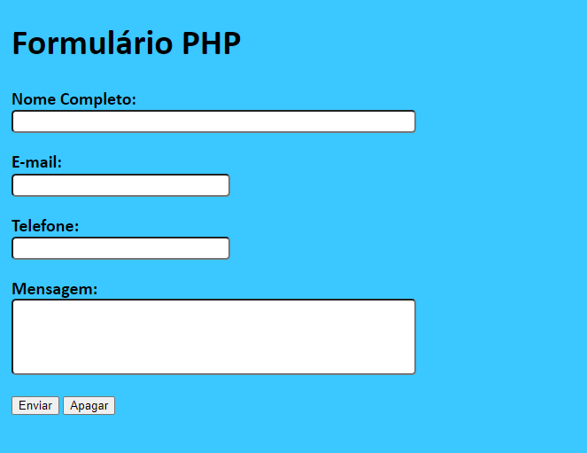

# Formulário PHP

Formulário simples para treino de linguagem, feito em PHP e CSS.

 

<h2>Como usar?</h2>

1. Preencher todos os campos do formulário, e clicar em Enviar.

2. Para limpar os campos, clique em Apagar.

<h2>Licença</h2>

MIT (Massachusetts Institute of Technology)

 
